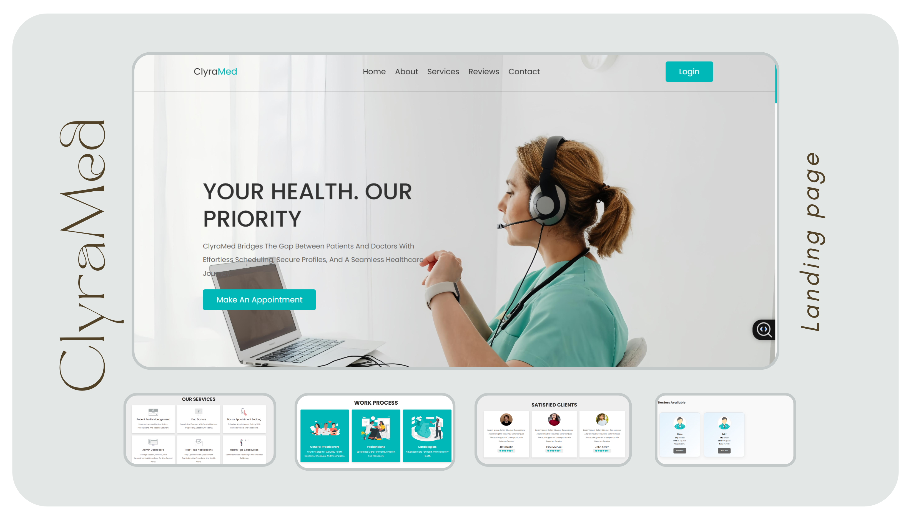
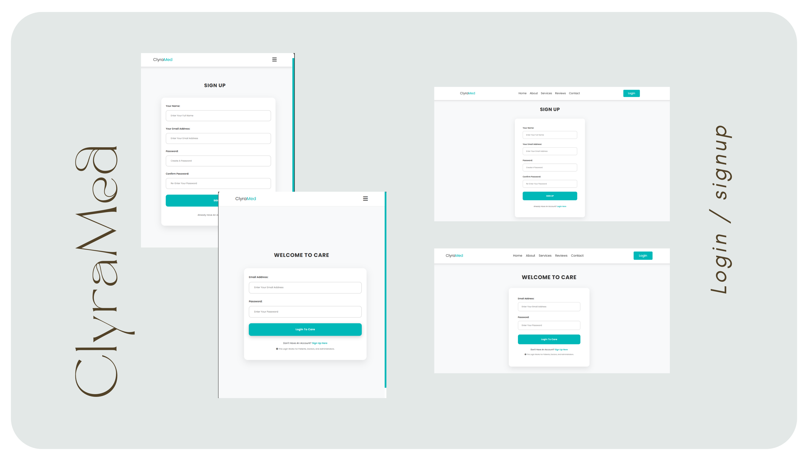
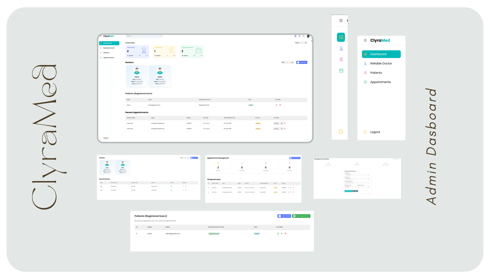
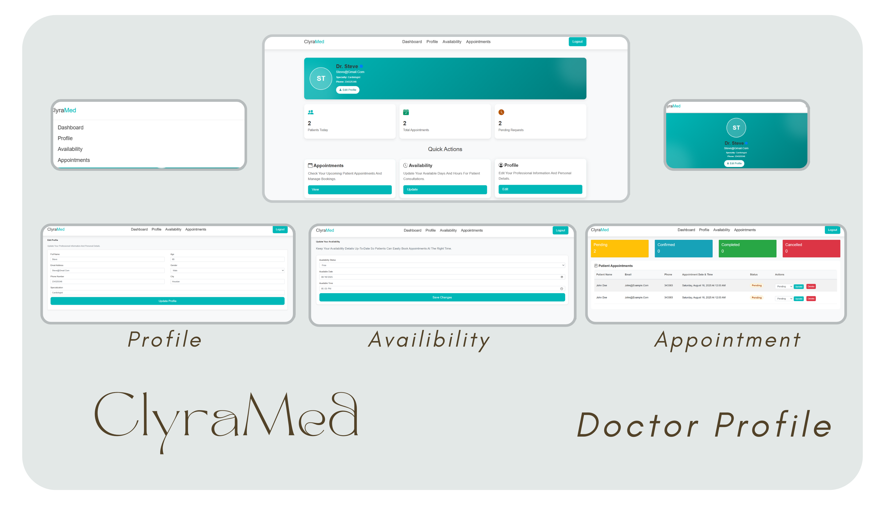

ClyraMed – Clarity in Care

ClyraMed is a doctor appointment management platform designed to make healthcare access simple, transparent, and efficient. It allows patients to easily book appointments, while admins and doctors can manage users, schedules, and consultations through a clean and user-friendly interface.

## 🖼 Screenshots

### Homepage

### Login Page

### Admin Booking

### Doctor Profile

✨ Features
👩‍⚕️ Patients

Register and log in securely

Browse doctors and specialties

Book, view, and cancel appointments

Simple dashboard for tracking visits

🏥 Doctors

Manage their profiles and availability

View assigned patient appointments

Update consultation details

👨‍💼 Admins

Create and manage doctor accounts

Oversee appointments and patient records

Handle system-wide settings

📂 Project Structure
/
├── assets/             # Images, CSS, and static files
├── doctor/             # Doctor-related interface/pages
├── appointment.php     # Appointment booking logic
├── code.php            # Core configuration / database connection
├── create_admin.php    # Admin account creation
├── doctorProfile.php   # Doctor profile management
├── header.php          # Common navigation/header
├── index.php           # Homepage
├── login.php           # User login (patients/admins/doctors)
├── logout.php          # Logout functionality
└── signup.php          # New user registration

⚙️ Installation & Setup

Clone the repository
git clone https://github.com/abdulkarim78/Care.git
cd Care

Run the application
Open your browser and go to:
http://localhost:8000

🛠 Technologies Used

PHP – Server-side scripting

MySQL – Database management

HTML5, CSS3, JavaScript – Frontend styling & interactions

🚀 Future Enhancements

Email/SMS notifications for appointments

Role-based access with finer permissions

Advanced search and filtering of doctors

Calendar view for appointments